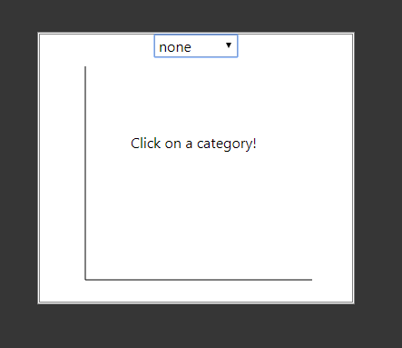

# Basic Info
## The Great Global Conflict: Battle-by-Battle
## https://github.com/ChrisBrown46/CS5890_Project

| Names             	| A#s       	| Emails                                	|
|-------------------	|-----------	|---------------------------------------	|
| Christopher Brown 	| A01889018 	| christopher.r.brown@aggiemail.usu.edu 	|
| Gavin Browning    	| A01887359 	| gavin.browning@aggiemail.usu.edu      	|
| Justin Fairbourn  	| A01842387 	| justin.fairbourn@gmail.com            	|

 # Background and Motivation
 We are interested in this topic because we wanted to create a good scrollytelly example and found that historic stories would be a great way to do so. We chose to do World War II because it's an extremely well known topic and one that intrests many people.

 # Project Objectives
 The primary questions we are trying to answer are whether or not we can create a good scrollytelly example. Additionally, we want to be able to show the difference in severity in battles where severity is based upon casulties, costs, and weapons used.
 We would like to learn more about semantic zooming and user interaction. We would like to accomplish a design where users are able to learn about the scale and history behind WWII in a way raw data could not.

 # Data
 We will be collecting our data from https://www.secondworldwarhistory.com/world-war-2-statistics.php and other sites that provide financial information about damages from individual battles. We will be collecting this data manually from the web pages because we were unable to find any aggregated data on the web.

 # Data Processing
 We expect to do most of the data cleanup when we manually enter the data. We plan on targeting the most popular and well known battles, so we expect to have data on about 10-15 battles. Each battle will contain 15-20 attributes in addition to the textual history behind the battle. In total, this would be about 150-300 pieces of data in addition to the textual history. We will be placing this data into JavaScript Object Notation.

# Visualization Designs

This will be a selector that allows the user to jump to a position in the story. They will be able to click a battle to go to it.

This is an overall view of the world that is shown during the story. It will show general information such as points of interest (battles) along with some extra features to show important battles and what one will be shown next. It has similar functionality as the year-battle chart in that a user can click a dot (battle) and immediately be brought to that position in the story. Dots (battles) may also be hovered over to display a tooltip that summarizes the battle.

This will be the text on the right side of the screen that tells a history behind the War with an emphasis on specific battles. Once a battle is reached in the story, the left hand side will be updated to a different visualization. Users can scroll back and forth in the story to go back in time or forward in time.

This is similar to the battle map, but it is a zoomed in region around a specific battle. It allows for more information to be displayed and will feature two bar charts on the corners that provide additional battle details.

This is a stacked barchart that has factions as categories and number of casulties as quantities. There will be another bar next to each faction that shows the average casulties per battle.

This is a barchart that has weapons used as categories and number of weapons used as quantities. There will be bars next to each other that are color coded to show the different factions. There will be dotted line on each set of bars that show average weapons used per battle.

This is the same as battle casulties but will be displayed at the end in a large format to show the total casulties across the entire World War.

This is the same as weapons used but will be displayed at the end in a large format to show the total weapons used across the entire World War.

# Must-Have Features
* Must have a year battle chart built to the before mentioned specifications.
* Must have a battle map chart built to the before mentioned specifications.
* Must have a scrolly telly text section built to the before mentioned specifications.
* Must have a semantic zoom world chart built to the before mentioned specifications.
* Must have a battle casulties chart built to the before mentioned specifications.
* Must have a weapons used chart built to the before mentioned specifications.
* Must have a total casulties chart built to the before mentioned specifications.
* Must have a total weapons used chart built to the before mentioned specifications.

* Must have events trigger from the text scrolling that will update the visualizations on the left.
* Must display the information of 10 battles.
* Must be colored in such a way that color blindness will not affect the visualizations.
* Must have transitions between each visualization when events are triggered.
* Must have valid HTML and properly formatted JavaScript and CSS.

# Optional Features
* May have extra charts to show miscellaneous battle information. i.e. medal of honors, civilian casulties, ...
* May have additional battles.

# First Implementation
1. BattleCasulties/WeaponsUsed Bar Charts: Our goal was to take the different bar charts suggested in the must-have section (battle casualties, weapons, etc.) and create a single bar chart within a div that allows the user to switch between categories using a select element.

The challenge here was getting the select's onchange() function to work dynamically and generally depending on which categories and values pertain to the specific battle the user is exploring.

Our implementation creates the div, svg, select, and axis lines once, and then d3 creates the bars dynamically depending on which category the user selects.

More work is needed to finalize the design, implement the axes, and create a class definition, but overall the data is handled correctly and the select functions dynamically as it should.

2. Year Battle Chart: Our intent with this visualization was to allow users to move between battles without having to use the scroll functionality. It also allows users to have a sense of where they are in the overall story.

Another feature we wanted was a smooth transition in the scrolling feature so that when users selected a new battle, they would clearly see the story moving back in time, or forward.
Along with the above mentioned feature, we wanted a smooth transition in the visualization so feedback is given in both the text and visualization.
(No great picture for these features.)
We also used coloring to show users how far along they are with the story, what they have already read (or have skipped), and what is remaining. This can be seen in the first picture with the coloration (green = done, yellow = reading).

# Second implementation

The intent of the timeline at the top is to provide chronological context to the other parts of the visualization. When scrolling through the story, it turns different colors to let the user know where they are in the timeline (green for completed, gray for not started, and yellow for in progress). Users can also click on a circle to make the rest of the visualization show the data for the battle it represents.

From our prototype, our individual, draggable bar chart evolved into 3 separate bar charts that the user can modify to display different datasets for each battle. None of these are draggable, but they are distinct and reactive such that each one can show a different dataset and they update automatically as the user scrolls. Each category is chosen from a dropdown of the attributes available for each battle. These were also left slightly translucent, so as to let the user see the map behind them.

Map Chart: Our intent with this visualization was to help provide spatial context of the battles and allow the user to follow along where the battles were taking place.  Having the visualization zoom in and out of the battle locations helps the user keep track of where each battle happened.  We also color coded each country by what side they are on.

# First Evaluation
1. BattleCasulties/WeaponsUsed Bar Charts: At a very basic level, the visualization does what it is supposed to. It receives the data it needs and handles it correctly, building its components dynamically allowing for higher user interactivity regardless of which battle is being observed.

One issue with the data that needs further exploration is the existence of outliers and null values for certain categories. For instance, in some battles only one side may have data on number of POW's taken or artillery used. Or in some cases, maybe one side may have roughly 3,000 soldiers lost compared to 100,000 lost by the other side. Having the data displayed in the bar chart the way it is now allows us to make decisions on whether we should display these outliers/categories or throw them out of the bar chart entirely.

There's still a fair amount of work that needs to be done for this part of the visualization, but the important thing is that the DOM element function correctly and the data is organized in a way that will make the following tasks easy. Tasks that still need to be completed for my part of the visualization include:
  - Redefining popupChart.js to be a class definition similar to the other charts and visualizations created for index.html
  - Implementing the axes to load and adjust dynamically and correctly for each category in each battle
  - Improving the coloring and other styling for the popupChart to make it fit better with the visualization as a whole
  - Implementing tooltip functionality for the bars in the bar chart to provide the user with exact information on the numbers and forces of each category
  - Implementing better transitions and titles for the popupChart that allow the user to retain context as they switch between categories

2. Year Battle Chart: There was not a whole lot we learned from this visualization. It was meant to provide navigation for the main visualizations.

The visualization works really well and is surprisingly fun to play with. It is intuitive to use and very responsive.
Some improvements that are planned include: labels on the circle for battle names, different color scheme, and possibly a continous flow between circles instead of checkpoints.

# Second evaluation
Our insights about the data from the prototype were further enforced; the datasets for a lot of the battles were incomplete or otherwise faulty. However, implementing 3 separate bar charts as opposed to a single one made it easier to draw connections between different attributes for the same battle, i.e. soldier number and casualties, or opposing force size and casualties. As for how the visualization works, all of the separate pieces came together quite effectively through our good use of classes and abstraction. To further improve it, we could make the transitions on the bar charts and the map work in unison, and also find a way for the select boxes on each of the bar charts to only display the attributes for which the current battle has data. We could also look into labelling the countries, or changing the colors as the user scrolls to reflect when one force captures it.

After out prototype, we took the feedback given by others and adjusted our design so that three visualizations appear on the right hand side of the map and are static. This was in line with our original design where we did not want any interaction from the user with the small visualizations because the user is already doing enough by having to scroll and navigate around the map.

The map did not end up in the state we desired. We wanted to have battles appear as circles on the map so users could jump to the battles by clicking them or have them link to the navigation chart through highlighting corresponding battles.

The navgiation chart ended in a good state. We added text around the circles to better describe what battles are occuring. It performed well and we managed to reach our stretch goals for it where scrolling was smooth in the scrolling area when circles were selected.

Map Chart: There was not a lot that we learned from the map data, but it was interesting learning how the map transition zooming works. The visualization works well although the zooming can feel laggy when it zooms out and back in when the battle’s change.  We could further improve this visualization by adding more points on the map, maybe things like arrows showing the direction of battle and having the country names show up.

# Project Schedule
1. November 5th - Proposal finished.
  - Done!
2. November 12th - Battles chosen and data consolidated. Text portion started.
  - The conclusion is missing.
3. November 19th - HTML finished along with JavaScript classes' skeletons.
  - Done!
4. November 26th - Text portion finished with the 3 major visualizations finished.
  - Done!
5. November 30th - Completed to specifications.
  - Not Done!
